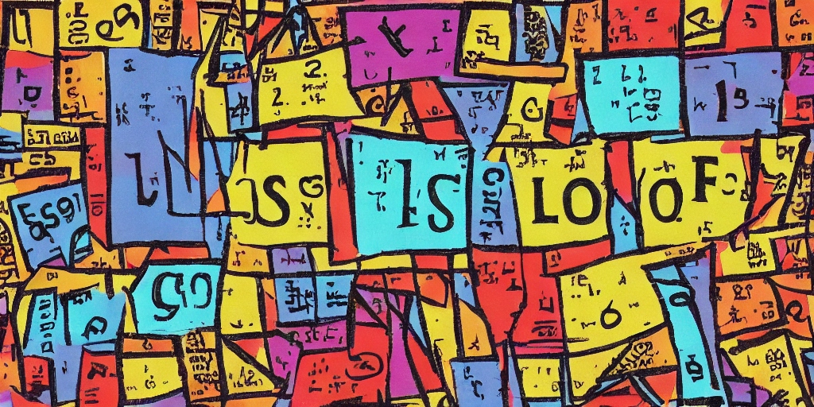

# My Data Science Origin Story

## That's not a thing
I studied philosophy and literature in undergrad. My favorite class was symbolic logic. I liked it so much I’d do every exercise in the text book and made up more problems on my own to solve. I took every undergrad and grad logic class my university offered. I remember wondering if I can … do logic for a living some day. I found out that isn’t a thing. (No surprise there!) Nobody makes a living turning natural language propositions into formal mathematical logic. Instead I was told “if you like formal logic you might have an aptitude for computer science”. I took a couple courses (no undergrad degree) - which turned out to be true

## Assistant professor - people think they know what you do
That lead to studying linguistics … then computation linguistics … then machine learning and becoming an academic.

## Wait ... that's a thing? 
Around 2012 I met the data science team at Kobo Books. They were the first data scientists I had met … and in fact the first time I heard about data science. I didn’t realize this professional field existed. You mean this is …. a thing!?! You can work with data wrangling and probability and machine learning all day?! … and you actually get paid?! …. scratch that - you actually get very very well paid?! Where do I sign up? I did a career switch shortly after and have been a working data scientist ever since. 

## Data scientist means no one knows what I do
This was the same year that *Harvard Business Review* declared “Data Scientist“ to be the sexiest career of the 21st century.
Not sure about the job being “sexy” in any sense, but I do find the work fulfililng. I like how [Geekosystem](https://www.themarysue.com/data-scientist-sexy/) made a crack about that the “sexiest career” thing with tongue firmly planted in cheek: 
>  Because if there’s one thing that gives a job an indefinable allure, it is everybody else being kind of unsure what it is you really do — a quality that data scientists damn near embody.
